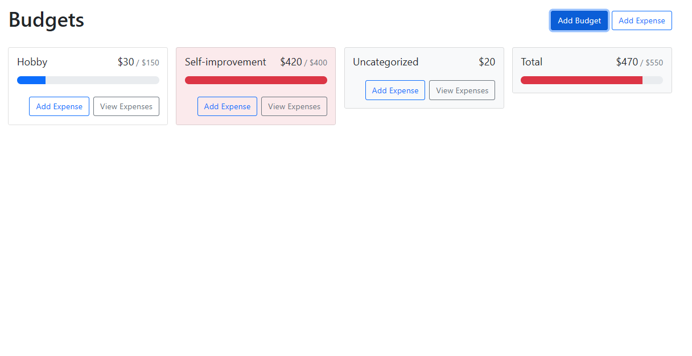
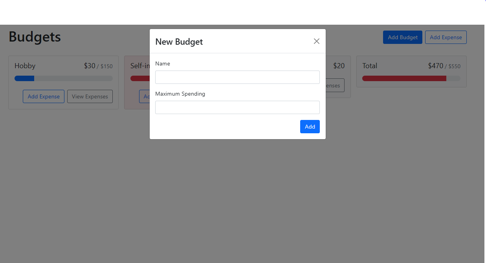
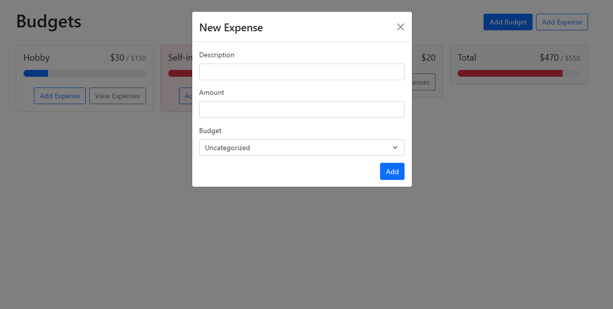
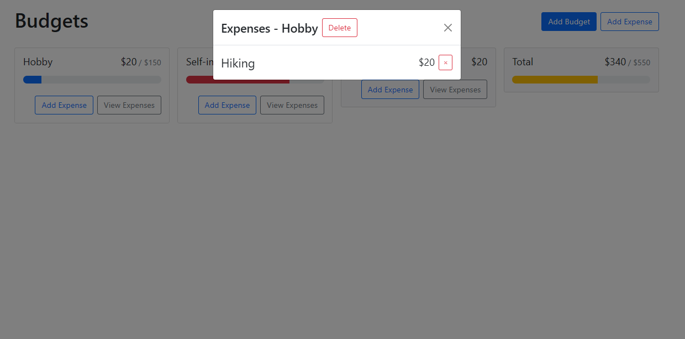

# Personal Budget Tracking Application

Application build with support of React JS, React-Bootstrap, Bootstrap and UUID library

Before running this application make sure to install node-modules with the following commands: <h4>npm install</h4>

# Preview application:

# Deployment:

You can deploy this application with Netlify or Vercel.

This project was bootstrapped with [Create React App](https://github.com/facebook/create-react-app).
